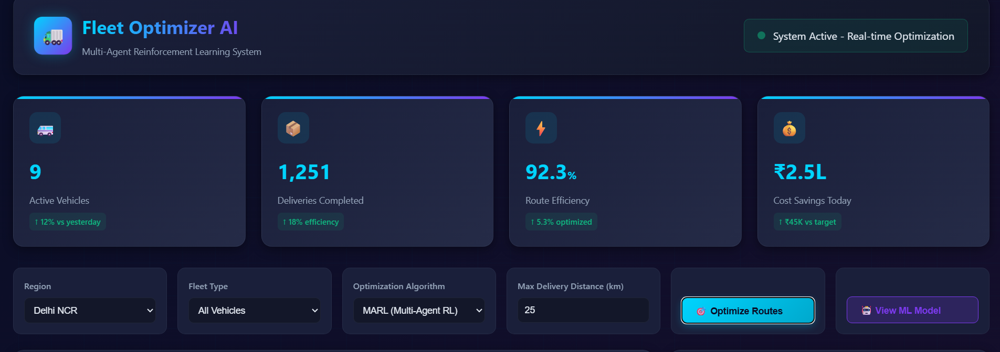
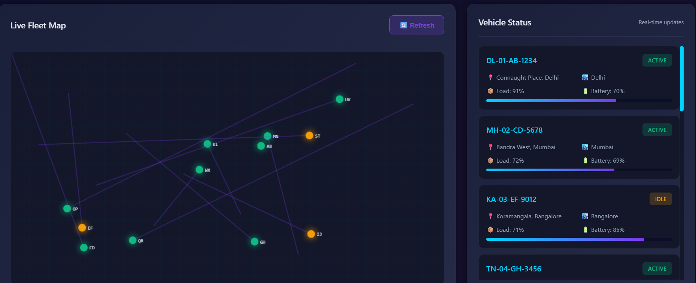
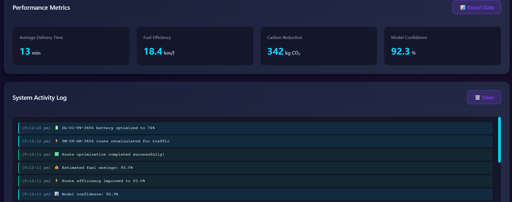

# AI Fleet-Optimizer

## Overview
Fleet Optimizer AI is a real-time Multi-Agent Reinforcement Learning (MARL) web application designed to optimize and manage a fleet of autonomous delivery vehicles, drones, and warehouse robots. The app simulates intelligent route planning, fleet status monitoring, and analytics with a slick, modern interface and smooth animations.

---

---
## Features
- Real-time visualization of delivering vehicles on Indian city maps (Delhi, Mumbai, Bengaluru, Chennai, Hyderabad)
- Multi-agent deep Q-learning model (MADQN) simulated for fleet route optimization
- Live tracking of vehicle status, battery levels, and route efficiency
- Interactive analytics dashboard displaying cost savings, fuel efficiency, and carbon footprint reduction
- Customizable fleet types and city selection
- Downloadable ML model pickle simulation file included

